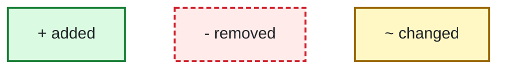
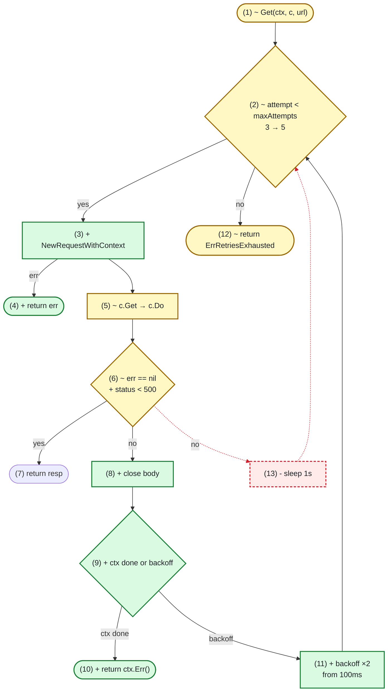
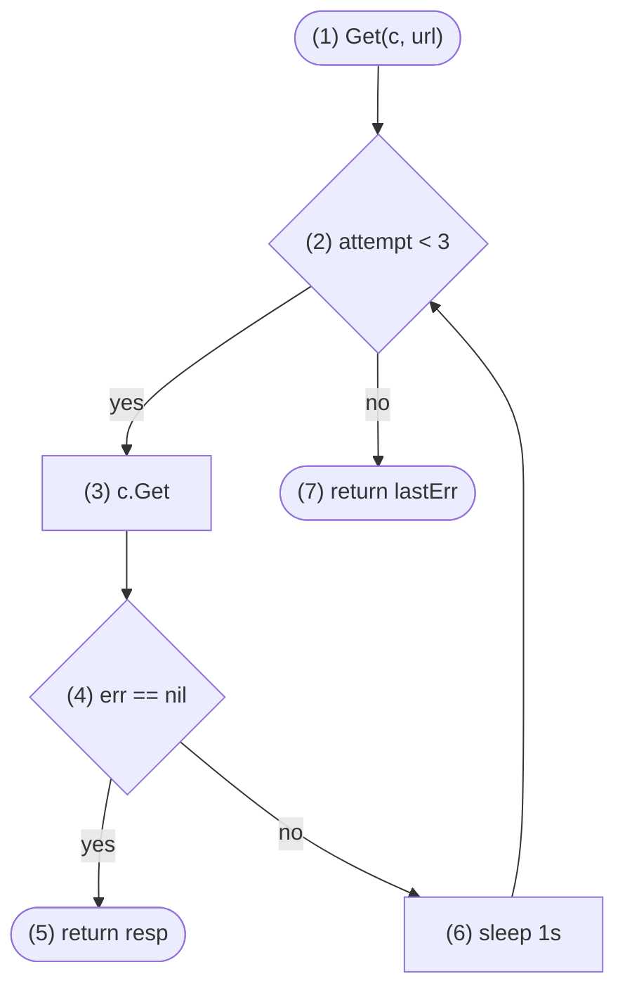
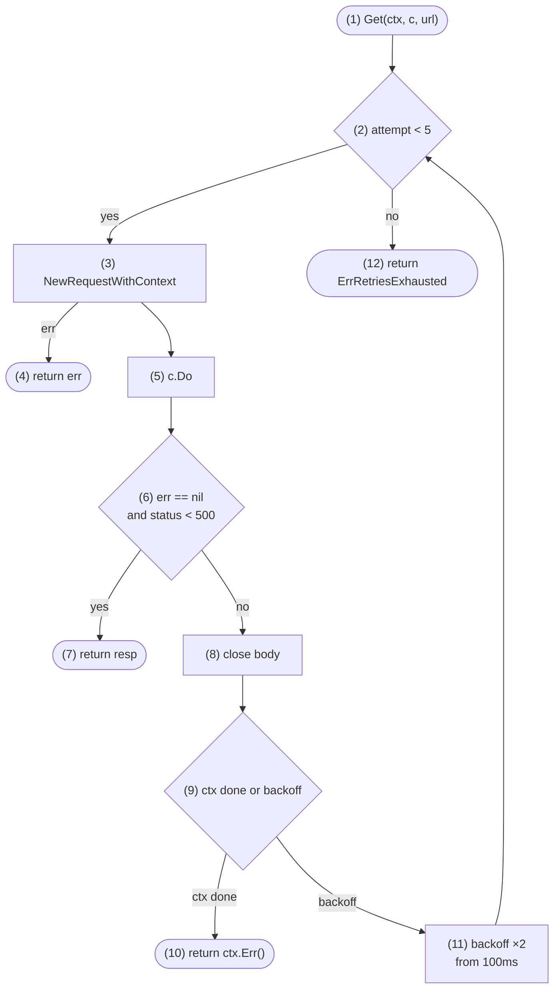

## Legend

## What changes in fetch.Get?

1. [examples/code-change/after/retry.go#L15](../examples/code-change/after/retry.go#L15)
2. [examples/code-change/after/retry.go#L17](../examples/code-change/after/retry.go#L17)
3. [examples/code-change/after/retry.go#L18](../examples/code-change/after/retry.go#L18)
4. [examples/code-change/after/retry.go#L19-L21](../examples/code-change/after/retry.go#L19-L21)
5. [examples/code-change/after/retry.go#L22](../examples/code-change/after/retry.go#L22)
6. [examples/code-change/after/retry.go#L23](../examples/code-change/after/retry.go#L23)
7. [examples/code-change/after/retry.go#L24](../examples/code-change/after/retry.go#L24)
8. [examples/code-change/after/retry.go#L26-L28](../examples/code-change/after/retry.go#L26-L28)
9. [examples/code-change/after/retry.go#L29-L33](../examples/code-change/after/retry.go#L29-L33)
10. [examples/code-change/after/retry.go#L30-L31](../examples/code-change/after/retry.go#L30-L31)
11. [examples/code-change/after/retry.go#L34](../examples/code-change/after/retry.go#L34)
12. [examples/code-change/after/retry.go#L36](../examples/code-change/after/retry.go#L36)
13. [examples/code-change/before/retry.go#L19](../examples/code-change/before/retry.go#L19)

## How does Get retry before?

1. [examples/code-change/before/retry.go#L11](../examples/code-change/before/retry.go#L11)
2. [examples/code-change/before/retry.go#L13](../examples/code-change/before/retry.go#L13)
3. [examples/code-change/before/retry.go#L14](../examples/code-change/before/retry.go#L14)
4. [examples/code-change/before/retry.go#L15](../examples/code-change/before/retry.go#L15)
5. [examples/code-change/before/retry.go#L16](../examples/code-change/before/retry.go#L16)
6. [examples/code-change/before/retry.go#L19](../examples/code-change/before/retry.go#L19)
7. [examples/code-change/before/retry.go#L21](../examples/code-change/before/retry.go#L21)

## How does Get retry after?

1. [examples/code-change/after/retry.go#L15](../examples/code-change/after/retry.go#L15)
2. [examples/code-change/after/retry.go#L17](../examples/code-change/after/retry.go#L17)
3. [examples/code-change/after/retry.go#L18](../examples/code-change/after/retry.go#L18)
4. [examples/code-change/after/retry.go#L19-L21](../examples/code-change/after/retry.go#L19-L21)
5. [examples/code-change/after/retry.go#L22](../examples/code-change/after/retry.go#L22)
6. [examples/code-change/after/retry.go#L23](../examples/code-change/after/retry.go#L23)
7. [examples/code-change/after/retry.go#L24](../examples/code-change/after/retry.go#L24)
8. [examples/code-change/after/retry.go#L26-L28](../examples/code-change/after/retry.go#L26-L28)
9. [examples/code-change/after/retry.go#L29-L33](../examples/code-change/after/retry.go#L29-L33)
10. [examples/code-change/after/retry.go#L30-L31](../examples/code-change/after/retry.go#L30-L31)
11. [examples/code-change/after/retry.go#L34](../examples/code-change/after/retry.go#L34)
12. [examples/code-change/after/retry.go#L36](../examples/code-change/after/retry.go#L36)
