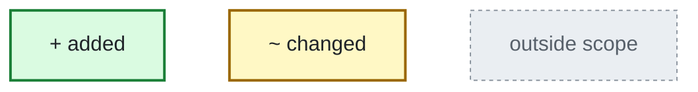
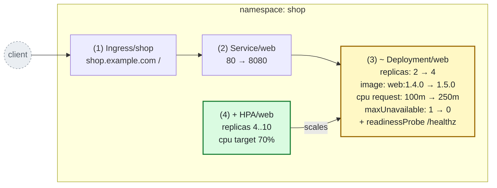
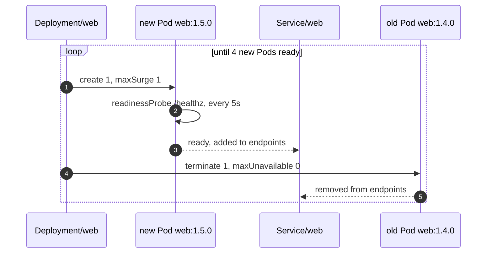
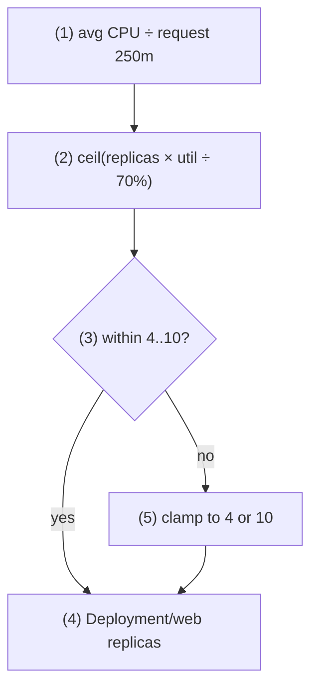

## Legend

## What changes in namespace shop?

1. [examples/k8s-change/after/web.yaml#L49-L65](../examples/k8s-change/after/web.yaml#L49-L65)
2. [examples/k8s-change/after/web.yaml#L37-L47](../examples/k8s-change/after/web.yaml#L37-L47)
3. [examples/k8s-change/after/web.yaml#L1-L35](../examples/k8s-change/after/web.yaml#L1-L35)
4. [examples/k8s-change/after/web.yaml#L67-L85](../examples/k8s-change/after/web.yaml#L67-L85)

## How does a rollout of Deployment/web proceed?

1. [examples/k8s-change/after/web.yaml#L11](../examples/k8s-change/after/web.yaml#L11)
2. [examples/k8s-change/after/web.yaml#L26-L31](../examples/k8s-change/after/web.yaml#L26-L31)
3. [examples/k8s-change/after/web.yaml#L43-L44](../examples/k8s-change/after/web.yaml#L43-L44)
4. [examples/k8s-change/after/web.yaml#L12](../examples/k8s-change/after/web.yaml#L12)
5. [examples/k8s-change/after/web.yaml#L43-L44](../examples/k8s-change/after/web.yaml#L43-L44)

## When does HPA/web scale?

1. [examples/k8s-change/after/web.yaml#L34](../examples/k8s-change/after/web.yaml#L34)
2. [examples/k8s-change/after/web.yaml#L85](../examples/k8s-change/after/web.yaml#L85)
3. [examples/k8s-change/after/web.yaml#L77-L78](../examples/k8s-change/after/web.yaml#L77-L78)
4. [examples/k8s-change/after/web.yaml#L73-L76](../examples/k8s-change/after/web.yaml#L73-L76)
5. [examples/k8s-change/after/web.yaml#L77-L78](../examples/k8s-change/after/web.yaml#L77-L78)
