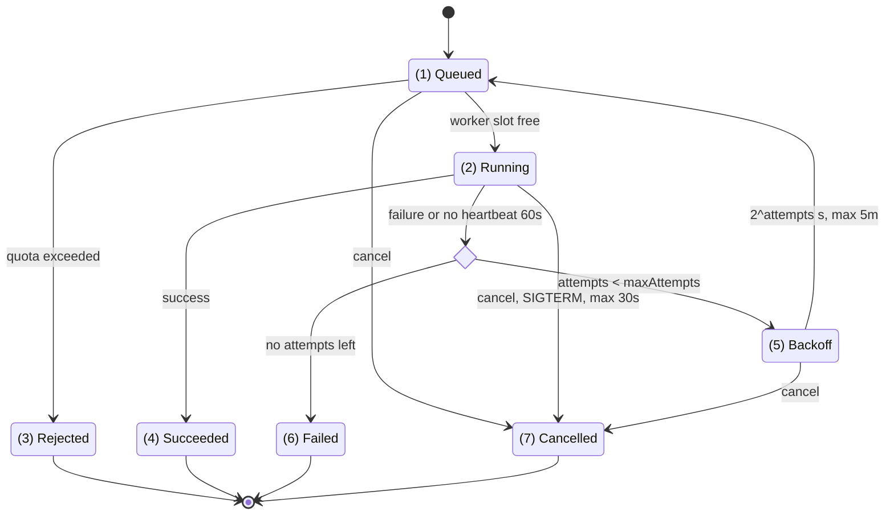

## How does a job move between states?

1. [examples/doc-excerpt/job-lifecycle.md#L5](../examples/doc-excerpt/job-lifecycle.md#L5)
2. [examples/doc-excerpt/job-lifecycle.md#L5-L9](../examples/doc-excerpt/job-lifecycle.md#L5-L9)
3. [examples/doc-excerpt/job-lifecycle.md#L6-L7](../examples/doc-excerpt/job-lifecycle.md#L6-L7)
4. [examples/doc-excerpt/job-lifecycle.md#L11](../examples/doc-excerpt/job-lifecycle.md#L11)
5. [examples/doc-excerpt/job-lifecycle.md#L12-L17](../examples/doc-excerpt/job-lifecycle.md#L12-L17)
6. [examples/doc-excerpt/job-lifecycle.md#L12-L14](../examples/doc-excerpt/job-lifecycle.md#L12-L14)
7. [examples/doc-excerpt/job-lifecycle.md#L19-L21](../examples/doc-excerpt/job-lifecycle.md#L19-L21)
